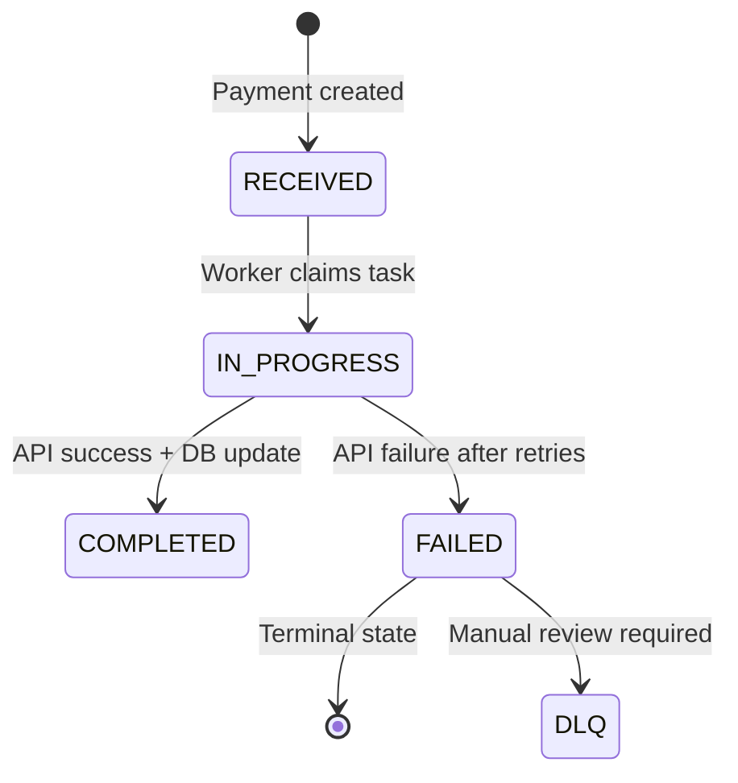
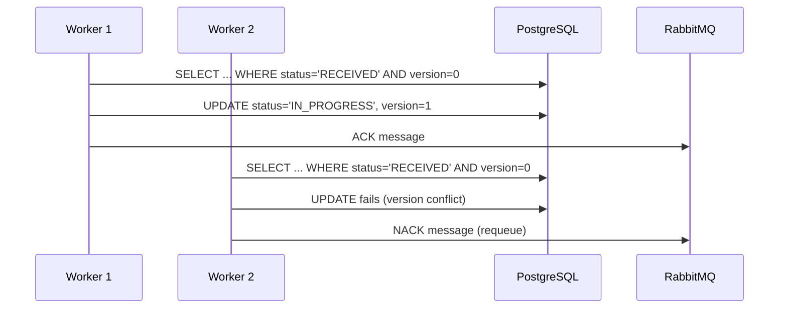

# Phase 1 Design: Data Model

**Feature**: F-PAY-001 Resilient Distributed Payment Bridge
**Date**: 2026-05-07
**Status**: Design Phase Complete

## Database Schema

### Payment Table

**Purpose**: Core payment entity with optimistic locking for concurrent processing.

```sql
CREATE TABLE payment (
    payment_id UUID PRIMARY KEY,
    version INTEGER NOT NULL DEFAULT 0,
    client_reference VARCHAR(255),
    amount DECIMAL(19,4) NOT NULL CHECK (amount > 0),
    currency VARCHAR(3) NOT NULL,
    status VARCHAR(20) NOT NULL CHECK (status IN ('RECEIVED', 'IN_PROGRESS', 'COMPLETED', 'FAILED')),
    created_at TIMESTAMP WITH TIME ZONE NOT NULL DEFAULT CURRENT_TIMESTAMP,
    updated_at TIMESTAMP WITH TIME ZONE NOT NULL DEFAULT CURRENT_TIMESTAMP,

    -- API response data
    api_response JSONB,
    api_status_code INTEGER,
    external_transaction_id VARCHAR(255),

    -- Retry tracking
    retry_count_api INTEGER NOT NULL DEFAULT 0,
    retry_count_db INTEGER NOT NULL DEFAULT 0,

    -- Error context
    error_reason TEXT,
    error_details JSONB,

    -- Constraints
    CONSTRAINT payment_version_positive CHECK (version >= 0),
    CONSTRAINT payment_currency_valid CHECK (currency ~ '^[A-Z]{3}$'),
    CONSTRAINT payment_amount_positive CHECK (amount > 0)
);

-- Indexes for performance
CREATE INDEX idx_payment_status ON payment(status);
CREATE INDEX idx_payment_client_ref ON payment(client_reference);
CREATE INDEX idx_payment_created_at ON payment(created_at DESC);
CREATE UNIQUE INDEX idx_payment_idempotency ON payment(client_reference) WHERE client_reference IS NOT NULL;

-- Optimistic locking trigger
CREATE OR REPLACE FUNCTION update_payment_version()
RETURNS TRIGGER AS $$
BEGIN
    NEW.version = OLD.version + 1;
    NEW.updated_at = CURRENT_TIMESTAMP;
    RETURN NEW;
END;
$$ LANGUAGE plpgsql;

CREATE TRIGGER payment_version_trigger
    BEFORE UPDATE ON payment
    FOR EACH ROW
    EXECUTE FUNCTION update_payment_version();
```

**Key Design Decisions:**

1. **UUID Primary Key**: Ensures global uniqueness across distributed instances
2. **Version Column**: Optimistic locking prevents concurrent update conflicts
3. **JSONB Fields**: Flexible storage for API responses and error details
4. **Client Reference**: Optional idempotency key for duplicate detection
5. **Atomic Updates**: Trigger ensures version increment on all updates

### Message Queue Task Structure

**Purpose**: Lightweight task representation for RabbitMQ messaging.

```java
// Java representation (not stored in DB)
public class PaymentTask {
    private UUID paymentId;
    private String action; // "PROCESS_PAYMENT", "RETRY_DB_UPDATE"
    private int retryAttempt;
    private Instant enqueuedAt;
    private int dequeueCount;

    // Constructors, getters, setters
}
```

**RabbitMQ Message Format:**

```json
{
  "paymentId": "550e8400-e29b-41d4-a716-446655440000",
  "action": "PROCESS_PAYMENT",
  "retryAttempt": 0,
  "enqueuedAt": "2026-05-07T19:37:41Z",
  "dequeueCount": 0
}
```

### Dead Letter Queue Entry

**Purpose**: Persistent storage of failed payments requiring manual review.

```sql
CREATE TABLE dead_letter_queue (
    dlq_id UUID PRIMARY KEY DEFAULT gen_random_uuid(),
    payment_id UUID NOT NULL REFERENCES payment(payment_id),
    failed_action VARCHAR(50) NOT NULL, -- 'API_CALL', 'DB_UPDATE'
    failure_reason TEXT NOT NULL,
    payment_context JSONB NOT NULL, -- Snapshot of payment record
    api_response JSONB, -- Last API response if available
    retry_history JSONB NOT NULL, -- Array of retry attempts
    created_at TIMESTAMP WITH TIME ZONE NOT NULL DEFAULT CURRENT_TIMESTAMP,

    -- Foreign key constraint
    CONSTRAINT fk_dlq_payment FOREIGN KEY (payment_id) REFERENCES payment(payment_id)
);

-- Indexes
CREATE INDEX idx_dlq_payment_id ON dead_letter_queue(payment_id);
CREATE INDEX idx_dlq_created_at ON dead_letter_queue(created_at DESC);
CREATE INDEX idx_dlq_failed_action ON dead_letter_queue(failed_action);
```

## Entity Relationships

```
Payment (1) ──── (1) Dead Letter Queue
```

**Relationship Rules:**

- One payment can have zero or one DLQ entry
- DLQ entries are immutable (insert-only)
- Payment status remains FAILED when sent to DLQ

## Data Flow Diagrams

### Payment Lifecycle State Transitions



### Concurrent Processing Safety



## Optimistic Locking Implementation

### Update Pattern

```java
@Transactional
public boolean claimPaymentForProcessing(UUID paymentId) {
    int updated = jdbcTemplate.update("""
        UPDATE payment
        SET status = 'IN_PROGRESS', version = version + 1, updated_at = NOW()
        WHERE payment_id = ? AND version = ? AND status = 'RECEIVED'
        """, paymentId, expectedVersion);

    return updated > 0; // Returns true if claim succeeded
}
```

### Conflict Resolution

```java
public Payment processPayment(UUID paymentId) {
    Payment payment = paymentRepository.findById(paymentId).orElseThrow();

    while (true) {
        try {
            return claimAndProcess(payment);
        } catch (OptimisticLockingFailureException e) {
            // Another worker claimed this payment, find another task
            log.debug("Payment {} already claimed by another worker", paymentId);
            return findNextAvailablePayment();
        }
    }
}
```

## Performance Considerations

### Indexing Strategy

**Read-Heavy Operations:**

- `idx_payment_status`: Fast filtering of RECEIVED payments for workers
- `idx_payment_created_at`: Time-based queries for monitoring

**Write-Heavy Operations:**

- Primary key on `payment_id`: UUID lookups are fast
- Version column not indexed: Avoids write contention

### Connection Pooling

```yaml
spring:
  datasource:
    hikari:
      maximum-pool-size: 20 # Match prefetch count
      minimum-idle: 5
      connection-timeout: 30000
```

### Monitoring Queries

```sql
-- Active payments by status
SELECT status, COUNT(*) as count
FROM payment
WHERE created_at > NOW() - INTERVAL '1 hour'
GROUP BY status;

-- Version conflict rate
SELECT
    SUM(version) as total_versions,
    COUNT(*) as total_payments,
    AVG(version) as avg_conflicts
FROM payment
WHERE created_at > NOW() - INTERVAL '1 day';

-- DLQ backlog
SELECT
    failed_action,
    COUNT(*) as count,
    MIN(created_at) as oldest
FROM dead_letter_queue
WHERE created_at > NOW() - INTERVAL '24 hours'
GROUP BY failed_action;
```

## Migration Strategy

### Initial Schema Creation

```sql
-- Run on application startup (Flyway/Liquibase)
-- Version: V1.0.0__create_payment_tables.sql

-- Create tables as defined above
-- Add initial indexes
-- Set up triggers
```

### Schema Evolution

**Version 1.1.0**: Add monitoring columns

```sql
ALTER TABLE payment ADD COLUMN processing_started_at TIMESTAMP WITH TIME ZONE;
ALTER TABLE payment ADD COLUMN processing_completed_at TIMESTAMP WITH TIME ZONE;
```

**Version 1.2.0**: Enhanced error tracking

```sql
ALTER TABLE payment ADD COLUMN last_retry_at TIMESTAMP WITH TIME ZONE;
ALTER TABLE payment ADD COLUMN circuit_breaker_state VARCHAR(20);
```

## Backup and Recovery

### Backup Strategy

**Continuous Archiving:**

- WAL archiving enabled for point-in-time recovery
- Full backups daily during low-traffic windows
- Retention: 30 days for full backups, 7 days for WAL

**Backup Contents:**

- Payment records (critical business data)
- DLQ entries (failure investigation data)
- Exclude: Transient message queue data (recreated on restart)

### Recovery Procedures

**Instance Failure Recovery:**

1. Start new instance
2. RabbitMQ redelivers unacked messages
3. Workers resume processing from RECEIVED/IN_PROGRESS payments
4. Optimistic locking prevents duplicate processing

**Database Failure Recovery:**

1. Restore from latest backup
2. Replay WAL to latest consistent state
3. Verify payment state integrity
4. Resume message processing

## Security Considerations

### Data Protection

**Sensitive Data Handling:**

- Payment amounts: Encrypted at rest (if required by compliance)
- API responses: May contain sensitive data, audit access
- DLQ entries: Restricted access, manual review only

**Access Controls:**

- Application service account: CRUD on payment table
- Monitoring service: Read-only access
- Manual review team: Read-only on DLQ table

### Audit Trail

**Automatic Auditing:**

- All state transitions logged via triggers
- Version changes tracked for concurrency analysis
- API interactions logged at CRITICAL level

**Manual Audit:**

- DLQ entries serve as audit trail for failed payments
- Payment history reconstructable from version increments</content>
  <parameter name="filePath">/Users/mac/Programming/payment-system-speckit/specs/001-resilient-payment-bridge/data-model.md
